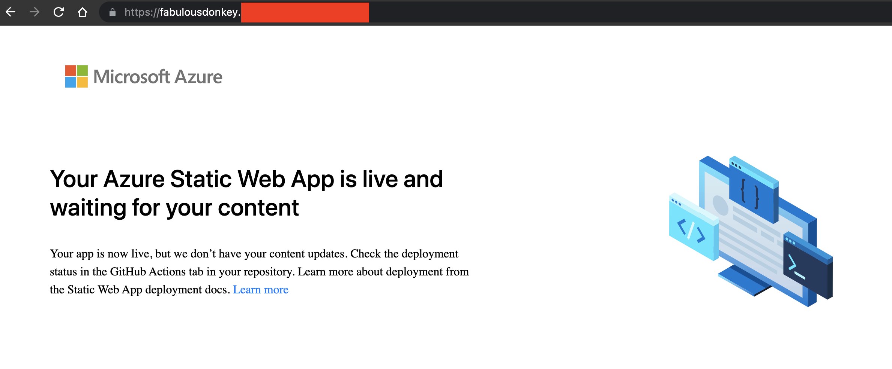

# Add a custom domain to Azure Static Web Apps with Azure Bicep

[](https://github.com/mattias-fjellstrom/azure-bicep-custom-domains/actions/workflows/azure-static-web-apps.yml)

This example demonstrates how to add a custom domain name for an Azure Static Web App during infrastructure setup using Azure Bicep. Note that this example will create an empty Static Web App. Modify the example to fit your needs.

## Prerequisites

- A DNS zone hosted in a separate resource group in your Azure subscription. If your DNS zone is in a different subscription than the one you deploy the Static Web App to you will need to modify the example accordingly.
- Install the Azure CLI ([instructions](https://docs.microsoft.com/cli/azure/install-azure-cli))
- Install the Azure Bicep CLI (install using the Azure CLI command `az bicep install`)
- Set your default Azure subscription (`az account set --subscription <subscription name or ID>`)

## Instructions

Set values for the required parameters. Note that Static Web Apps are only available in the following Azure locations: `centralus`, `eastus2`, `eastasia`, `westeurope`, and `westus2`.

```bash
location=westeurope
dnsZoneResourceGroupName=my-dns-resource-group
dnsZoneName=example.com
cnameRecord=fabulousdonkey
```

Deploy the example using the Azure CLI. Note that the location is set twice, once for the subscription scoped deployment (where the metadata related to the deployment is stored), and once for the location where the Static Web App will be deployed.

```bash
az deployment sub create \
  --name my-swa-deployment \
  --template-file main.bicep \
  --location $location \
  --parameters dnsZoneResourceGroupName=$dnsZoneResourceGroupName \
      dnsZoneName=$dnsZoneName \
      cnameRecord=$cnameRecord \
      location=$location
```

The `main.bicep` template is deployed to the subscription scope. A new resource group is created for the Static Web App, and the custom domain is added to the existing DNS Zone located in its own resource group. The deployment is split in three modules. The first module creates the Static Web App without a custom domain. The second module creates a CNAME record in the DNS Zone that points to the default hostname for the Static Web App. The third and final module creates the Custom Domain resource for the Static Web App.

Go to the deployed Static Web App resource in Azure to verify that the custom domain has been created. Click on _Custom domains_ in the left hand menu.


Open the custom domain in a browser to verify that it works (not that it can take a few minutes before it works correctly).



## Clean-up

Delete the resource group containing the Static Web App using the Azure CLI.

```bash
rg=$(az group list --query '[?tags.app == `azure-bicep-custom-domains-swa`] | [0].name' -o tsv)
az group delete -n $rg -y --no-wait
```

Delete the CNAME record from the DNS zone using the Azure CLI.

```bash
az network dns record-set cname delete \
  -g $dnsZoneResourceGroupName \
  -z $dnsZoneName \
  -n $cnameRecord \
  -y
```
